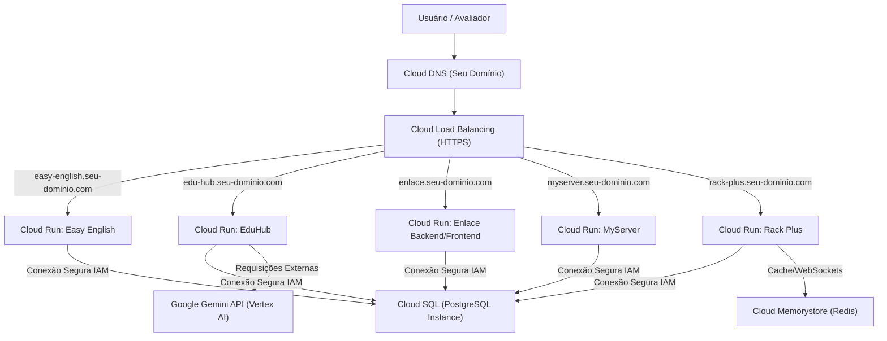

# Relatório de Viabilidade e Arquitetura de Deploy na Google Cloud Platform (GCP)

Este relatório avalia a viabilidade técnica e propõe a arquitetura de implantação na **Google Cloud Platform (GCP)** para os trabalhos de conclusão de curso dos alunos (ignorando o *Skillex* que já está implantado), utilizando um domínio customizado configurado na conta para exibição dos projetos sob uma estrutura de subdomínios.

---

## 1. Viabilidade Geral de Deploy na GCP

**Sim, é totalmente possível e altamente recomendado realizar o deploy de todas as aplicações na GCP.** 

Por se tratarem de aplicações conteinerizadas (com os `Dockerfiles` criados nos relatórios anteriores), o serviço mais eficiente, econômico e moderno para hospedá-las na GCP é o **Cloud Run** (serviço serverless baseado em contêineres que escala até zero quando não está em uso, gerando custo mínimo para fins acadêmicos).

---

## 2. Arquitetura de Serviços GCP Proposta

Para um ambiente acadêmico robusto e com custos controlados, sugerimos a seguinte infraestrutura:



### Detalhamento dos Componentes GCP:
1. **Google Cloud Run:** Hospeda as imagens Docker de cada aplicação. É totalmente escalável e cobra apenas pelo tempo de CPU consumido durante o processamento das requisições.
2. **Cloud SQL (PostgreSQL):** Uma única instância PostgreSQL compartilhada na nuvem é suficiente para abrigar todos os bancos de dados dos alunos de forma isolada, criando um banco lógico para cada grupo (`easyenglish_db`, `eduhub_db`, `enlace_db`, etc.).
3. **Cloud Memorystore (Redis):** Necessário especificamente para o projeto `repo-rack-plus` rodar as mensagens e sinais de WebSockets do Django Channels (Channel Layer).
4. **Cloud DNS & Load Balancing:** Gerencia o roteamento do seu domínio e cria mapeamentos HTTPS automáticos com certificados SSL gerenciados pelo Google gratuitamente.

---

## 3. Estruturação do Domínio e Subdomínios

Considerando que você possui um domínio configurado (ex: `meutcc.com.br` ou `seudominio.edu.br`), a melhor abordagem é configurar subdomínios para apontar para cada contêiner do Cloud Run correspondente:

* **`easy-english.seu-dominio.com`** $\rightarrow$ Direciona para o serviço Cloud Run do Easy English.
* **`edu-hub.seu-dominio.com`** $\rightarrow$ Direciona para o serviço Cloud Run do EduHub.
* **`enlace.seu-dominio.com`** $\rightarrow$ Direciona para o serviço Cloud Run do Enlace (podendo usar caminhos para separar frontend e backend ou subdomínio de API dedicado, ex: `api.enlace.seu-dominio.com`).
* **`myserver.seu-dominio.com`** $\rightarrow$ Direciona para o serviço Cloud Run do MyServer.
* **`rack-plus.seu-dominio.com`** $\rightarrow$ Direciona para o serviço Cloud Run do Rack Plus (com suporte nativo a WebSockets seguro `wss://` gerenciado pelo Google Load Balancer).

---

## 4. Passo a Passo do Deploy na GCP (Via CLI ou Console)

Abaixo está o procedimento prático para realizar o deploy de qualquer um dos projetos baseados em contêineres:

### Passo 1: Habilitar as APIs Necessárias no Projeto GCP
```bash
gcloud services enable run.googleapis.com \
                       sqladmin.googleapis.com \
                       artifactregistry.googleapis.com \
                       redis.googleapis.com
```

### Passo 2: Criar o Registro de Contêineres (Artifact Registry)
Crie um repositório Docker na região mais próxima (ex: `southamerica-east1` em São Paulo):
```bash
gcloud artifacts repositories create tcc-apps \
    --repository-format=docker \
    --location=southamerica-east1 \
    --description="Repositorio de imagens Docker dos alunos"
```

### Passo 3: Compilar e Enviar as Imagens (Cloud Build)
Dentro da pasta de cada aplicação que possui um `Dockerfile`, compile a imagem diretamente na nuvem de forma rápida:
```bash
gcloud builds submit --tag southamerica-east1-docker.pkg.dev/[ID_DO_PROJETO_GCP]/tcc-apps/[NOME_DO_REPO]:latest
```

### Passo 4: Implantar no Cloud Run
Implante o contêiner definindo as variáveis de ambiente necessárias no comando:
```bash
gcloud run deploy [NOME-DO-SERVICO] \
    --image=southamerica-east1-docker.pkg.dev/[ID_DO_PROJETO_GCP]/tcc-apps/[NOME_DO_REPO]:latest \
    --region=southamerica-east1 \
    --allow-unauthenticated \
    --set-env-vars="DJANGO_SECRET_KEY=[CHAVE],DJANGO_DEBUG=False,DATABASE_URL=[CONEXAO_CLOUD_SQL]"
```

### Passo 5: Mapeamento do Domínio Customizado
No painel do Cloud Run no Console GCP:
1. Acesse **Gerenciar Mapeamentos Personalizados** (Manage Custom Domains).
2. Adicione o seu domínio customizado e defina o subdomínio mapeando-o para o respectivo serviço Cloud Run.
3. O GCP gerará os registros DNS do tipo **CNAME** e **TXT** que você deve adicionar na zona DNS do seu provedor para comprovar posse e ativar o certificado SSL automático.

---
*Relatório GCP gerado em 2026-06-26 pelo assistente AI Antigravity.*
